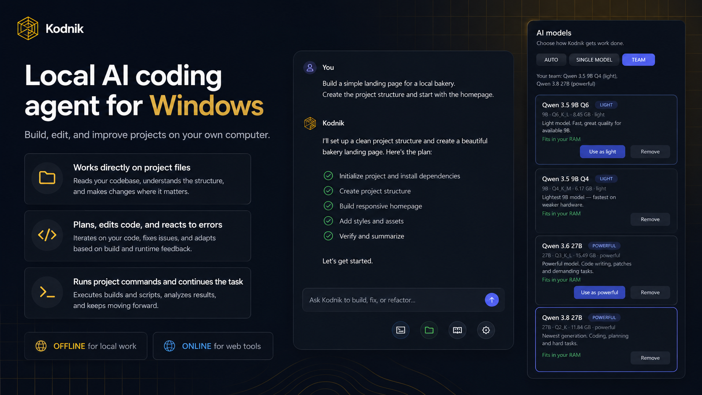

# Kodnik

**Local AI coding agent for Windows.**

Kodnik is a desktop coding agent built to work directly with software projects using local AI models.

It can inspect project files, understand existing code, create and edit files, execute terminal commands, work through multi-step tasks, and help take a project from an instruction to a working result.

**Local models. Real project access. Agentic coding. One desktop application.**

[Website](https://kodnik.com) · [Get Kodnik](https://kodnik.com) · [Report an issue](https://github.com/kodnik-ai/kodnik/issues)

---

## What Kodnik does

Kodnik is designed to do more than answer programming questions.

It can work directly with your project and take actions needed to complete coding tasks.

### Project-aware coding

* Read and analyze project files
* Understand existing codebases
* Navigate multi-file projects
* Find relevant files before making changes
* Work with project structure and context

### Create and edit code

* Modify existing files
* Create new files and folders
* Build new applications and projects
* Perform multi-file changes
* Refactor and extend existing code

### Agentic workflows

Kodnik can work through tasks that require multiple steps instead of stopping after a single response.

A typical workflow can include:

1. understanding the request,
2. inspecting the project,
3. planning the work,
4. editing files,
5. running commands,
6. checking the result,
7. fixing problems when necessary.

### Integrated terminal and tools

Kodnik can use development tools as part of the task instead of only suggesting commands for you to run manually.

This allows the AI to move between reasoning, code changes, command execution, and verification inside one workflow.

---

## Local AI

Kodnik is built around **local AI models**.

Your core coding workflow does not need to depend on a remote AI service. Models can run directly on your Windows machine and work with your projects locally.

This gives you direct control over:

* the model you use,
* where inference happens,
* your project files,
* your hardware,
* and how your coding environment is configured.

Kodnik can also support online capabilities when you choose to use them.

---

## Built for Windows

Kodnik is a desktop product built for Windows.

It brings together:

* AI chat,
* project context,
* file operations,
* code editing,
* agent workflows,
* local models,
* terminal execution,
* development tools,

inside one application.

---

## Use your own hardware

Local AI performance depends on the model, quantization, and hardware you choose.

Kodnik is designed to make local coding agents practical across different Windows configurations rather than requiring one fixed hardware setup.

You decide which local models make sense for your machine and workflow.

---

## Kodnik is a product, not a model

Kodnik does not try to replace the model itself.

It provides the environment around the model:

* project access,
* context,
* tools,
* file editing,
* execution,
* workflow control,
* model integration,
* and the desktop interface needed to turn an LLM into a coding agent.

The model provides intelligence.

**Kodnik gives it a workspace and the ability to act.**

---

## Get Kodnik

Kodnik is available for Windows at:

### **https://kodnik.com**

**$5.99 USD — one-time purchase.**

No subscription is required for the Kodnik license.

You can also try Kodnik from the official website before purchasing.

---

## Feedback and issues

Kodnik is under active development.

If you find a bug, unexpected agent behavior, compatibility problem, or have a feature request, open an issue:

**https://github.com/kodnik-ai/kodnik/issues**

Technical feedback is especially useful when it includes:

* what you asked Kodnik to do,
* what model was being used,
* what you expected,
* what actually happened,
* relevant logs or screenshots,
* hardware information when performance is involved.

---

## Official links

* **Website:** https://kodnik.com
* **GitHub:** https://github.com/kodnik-ai/kodnik
* **Issues:** https://github.com/kodnik-ai/kodnik/issues
* **Contact:** [kontakt@kodnik.pl](mailto:kontakt@kodnik.pl)

---

## Source code

This repository is the official public GitHub home for Kodnik.

The Kodnik application itself is proprietary software. Its source code is not published in this repository.

This repository is used for product information, documentation, issue tracking, releases, technical discussion, and project updates.

---

## Follow Kodnik

Development updates, releases, technical experiments, and new capabilities will be published through the official Kodnik channels.

**Local AI. Your code. Your machine. Kodnik.**
